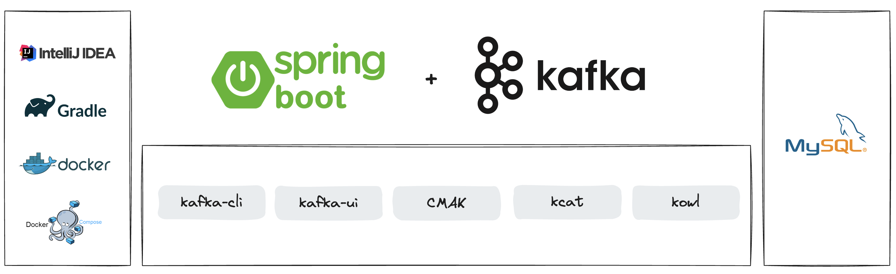
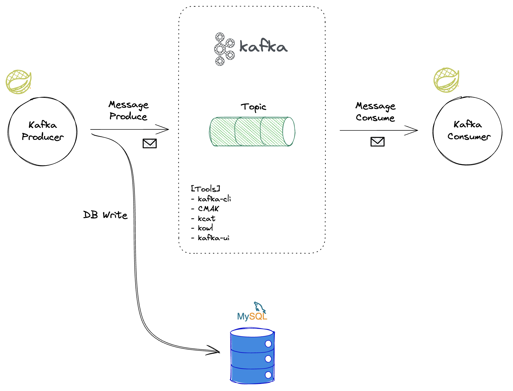
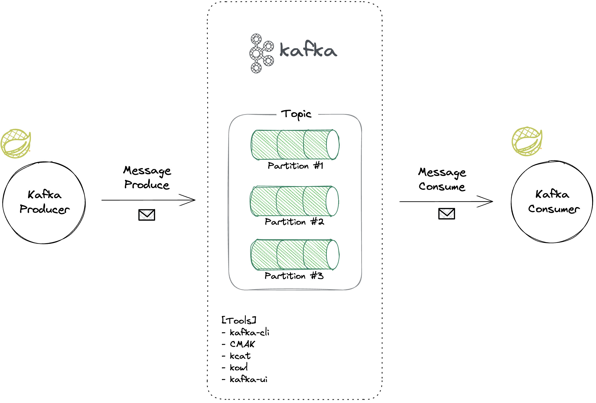
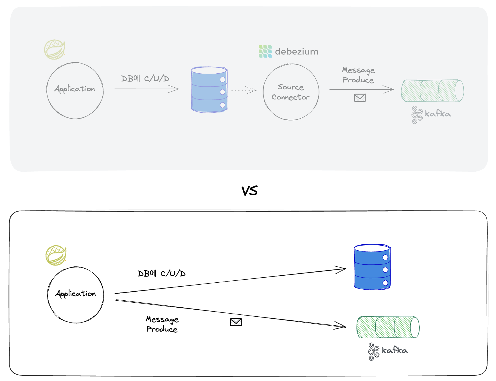
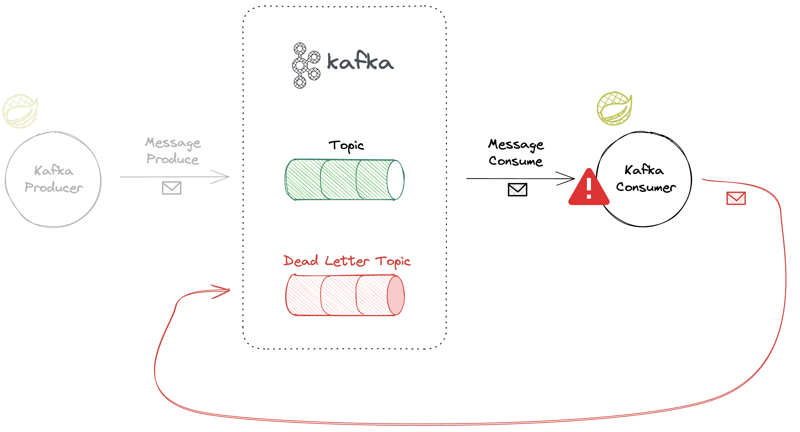

Fast Campus [한번에 끝내는 Kafka Ecosystem](https://fastcampus.co.kr/dev_online_newkafka) 강의의 Part 2-1. 백엔드 개발자의 메시징큐 교육용 자료입니다.

# Part 2-1. 백엔드 개발자의 메시징큐




**Kafka라는 Messaging Queue 플랫폼을 주제로, 백엔드 개발자가 실무에서 Kafka를 사용하기 위해 Producer/Consumer 차원의 기본적인 활용 방법, 이슈 대응 방법 등을 학습하기 위한 프로젝트입니다.**

총 5가지 Chapter로 구성되어 있으며, Ch.1 ~ Ch.3은 연속된 흐름에서 진행되고, Ch.4, Ch.5는 비교적 독립적으로 진행될 예정이에요.
백엔드 개발자 중에서도, Java+Spring을 다루는 분들이 실무에 바로 적용하실 수 있도록 기본적으로 Spring Boot와 JDK 17 기준으로 프로젝트를 구성하고 Spring-kafka와 Spring Cloud Stream을 통해 Kafka를 사용할 수 있는 개발환경을 셋팅해볼 거예요. 그 외에 Kafka 뿐만 아니라 MySQL 등 인프라적인 요소들은 모두 Docker를 통해 로컬에서 사용해요.
이번 파트(2-1)에서는 Kafka라는 메시징큐 앞뒤에 붙는 Producer와 Consumer 단위에서 실무적으로 맞닥뜨릴 수 있는 고민거리들에 대해 미리 문제를 해결해보는 연습을 합니다.
이렇게 메시징큐를 사용하는 단위 여럿이 모이면 실무에서의 Event Driven Architecture의 모습을 띠게 될 텐데 이는 다음 파트(2-2)에서 더 다루게 됩니다.
아래 내용들은 수업 진행 방향 및 실습 진행 속도에 따라 유동적일 수 있어요.

---

## Kafka Message 다뤄보기 (Ch. 1, 2, 3)

백엔드 개발자가 Kafka를 사용하기 위한 기본적인 실습을 다룹니다. Kafka를 한번도 다뤄보지 않은 분들도 이 과정을 실습하고 나면, 그동안 이론으로만 알고 있었던 Kafka의 컨셉을 실습 기반으로 체득하고 실무에서 Kafka를 활용하는 데에 자신감을 얻으실 수 있을 거예요.
**Chapter 1**에서는 Kafka를 다루기 위한 도구들을 경험해보고, Kafka의 개념적인 것들을 실체로써 눈으로 확인해보며 관리하는 실습을 해요.
**Chapter 2**에서는 본격적으로 실무 환경에서 Kafka를 다뤄볼 수 있도록, Spring Boot 환경에서 Kafka 개발환경을 셋팅해요. 간단하게 프로듀서와 컨슈머도 만들어 보아요.
**Chapter 3**에서는 다양한 실무적 요구 조건을 소화하기 위해 좀더 응용해서 Kafka 메시지를 자유자재로 다루어보는 연습을 해요.

### Ch 1. Kafka를 다루기 위한 도구 소개
- Kafka 실행해보기
- [도구1] kafka-cli : 토픽 생성하기, 파티션 늘리기, 메시지 프로듀스하기, 메시지 컨슘하기, 오프셋 리셋하기 실습
- [도구2] CMAK: 토픽 및 파티션 관리하기 실습
- [도구3] kcat : 메시지 프로듀스하기, 메시지 컨슘하기 실습
- [도구4] redpanda console(구. kowl) : 토픽 및 파티션 관리하기, 컨슈머그룹 관리하기, 메시지 목록 확인하기 실습
- [도구5] kafka-ui : 토픽 생성하기, 파티션 늘리기, 메시지 프로듀스하기, 메시지 컨슘하기, 오프셋 리셋하기, 메시지 목록 확인하기 실습

### Ch 2. Spring Boot에서 kafka 환경 설정하기
- Spring kafka를 이용한 Kafka 활용 실습
- Spring Cloud Stream을 이용한 Kafka 활용 실습

### Ch 3. Kafka Message 요리조리 다뤄보기
- Offset commit을 자동/수동으로 각각 실습
- Offset 관리 실습
- 중복 컨슘 다루기
- 메시지 처리량 늘리기

### 주요하게 사용되는 기술 스택

Kafka, Spring Boot, Java 17, Spring Data JPA, Mysql, Gradle, Docker, Docker Compose

#### 그 외 사용되는 기술들
- kafka-cli
- CMAK
- kcat
- Redpanda Console(구 Kowl)
- kafka-ui
- spring-kafka
- spring-cloud-stream

### 이해를 돕기 위한 그림



---

## Change Data Capture 구현하기 (Ch. 4)

실무에서는, 특히 MSA 환경에서는, DB에 write하는 것과 Kafka에 produce하는 게 함께 이루어져야 하는 경우가 많이 있는데요. 주로 데이터 변경사항을 Kafka로 연동해야 하는 경우에 해당하며, 이를 개념적으로는 CDC(Change Data Capture)라고 불러요. CDC를 제대로 활용하려면 Kafka Connect를 사용해야 하지만, 업무 환경에 따라 Kafka Connect 도입을 하기 어려운 경우도 있을 거예요. **Chapter 4**에서는 이러한 CDC에 대해 알아보고, Kafka Connect가 아닌 Application 레벨에서의 데이터 변경사항 Producer를 구현해볼 예정이에요.

### Ch 4. [Producer 심화] CDC (Change Data Capture)
- CDC에 대한 실무에서의 필요성 소개
- CDC를 Kafka Connect 기반으로 다루는 것의 장단점 소개
- CDC의 니즈를 충족하도록 Application 레벨에서 대체 구현해보기

### 주요하게 사용되는 기술 스택

Kafka, Spring Boot, Java 17, Spring Data JPA, Mysql, Gradle, Docker, Docker Compose

### 이해를 돕기 위한 그림



---

## Exception Handling하기 (Ch. 5)

Kafka를 사용하는 애플리케이션에는 Producer와 Consumer라는 큰 두 개의 축이 있지만, 결국 메시지를 유의미하게 다루는 본게임은 Consumer입니다. Consumer에서 Exception이 발생하면 전체적인 데이터 흐름의 병목이 되어 Lag이 쌓일 수 있는데요. **Chapter 5**에서는 컨슈머에서 Exception을 어떻게 핸들링하는지를 사례 기반으로 실습하고 경험치를 쌓아볼게요.

이번 실습을 하고 나면 spring-kafka의 개발환경 셋팅에서 맛보기로 다루고 넘어갔던 부분에 대해 더 상세한 셋팅을 할 수 있게 될 거예요.

### Part 5. [Consumer 심화] 예외 통제하기 (Exception handling)
- Retryable Exception의 경우 Retry하는 실습
- Unretryable Exception의 경우 ErrorHandler를 통해 핸들링 정책을 다루는 실습
- DLT (Dead Letter Topic) 소개

### 주요하게 사용되는 기술 스택

Kafka, Spring Boot, Java 17, Gradle, Docker, Docker Compose

### 이해를 돕기 위한 그림



---

## Execution

```
docker compose up -d
```

## Endpoints
- Tomcat Server
  - http://localhost:8080
  - Swagger UI: http://localhost:8080/swagger-ui/index.html
- Kafka
  - http://localhost:9092, http://localhost:9093, http://localhost:9094
- Zookeeper
  - http://localhost:2181
- Kafka UI
  - http://localhost:8081
- CMAK
  - http://localhost:9000
- Redpanda Console(구 Kowl)
  - http://localhost:8989
- Mysql
  - http://localhost:3306
  - root password: `1234`
  - database: `campus`
  - User/PW: `myuser`/`mypassword`
